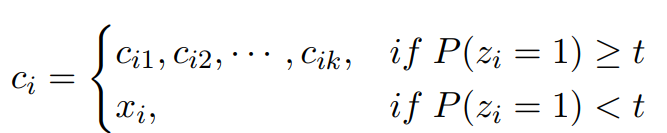
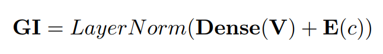
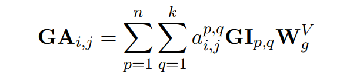

### Global Attention Decoder for Chinese Spelling Error Correction详解

在本篇文章中指出，以往的csc方法往往会使用bert等模型来提取局部的上下文信息，从而指导模型如何进行改错，但是，在这些上下文的信息中也会存在着错误的信息。为了解决以上的问题，本文主要提出了两种关于中文改错的新思路。

1. 提出一种新的bert替换策略，与之前的替换不同的是，这种策略是基于混淆集来进行引导的。
2. 提出一个提取全局上下文信息的办法，也就是文中称之为**Global Attention Decoder**的模块。这个模块的作用是学习潜在正确字符和潜在错误字符的候选之间的关系，通过学习更丰富的全局知识，从而达到缓解局部错误信息的干扰。

以上这篇文章提出的框架图，之后我将会对图片中的模块逐一进行分析。

#### Bert_CRS

在以往的csc方法中，通常会使用bert来作为上下文信息的提取器，bert作为近几年提出的强大的预训练模型，能够为各种各样的下游任务提供丰富的信息。以往的方法中往往会直接将google发布的已经训练好的bert模型来进行使用，最多在进行一下微调的操作。本篇文章中则提出了对bert进行专门预训练，也就是**Bert_CRS**。这种预训练方法和以往的方法区别在于：

1. 舍弃NSP任务的训练，原bert模型中的训练任务有NSP和MLM两个。NSP预测的是句子之间的关系，但CSC任务往往只关注句子内部的信息，因此NSP任务可以进行舍弃。
2. 在MLM任务的训练中，原bert的方法是将部分字符使用[MASK]来进行替换，但实际上[MASK]字符在下游任务中是不会存在的，因此这样的训练方法并不能学习到最准确的信息。在本篇本章中，方法是选择一定比例的音近和形近的混淆字符进行替换（具体的比例请阅读原论文），如果字符不存在混淆集才使用[MASK]来进行替换，这样的操作实际上和CSC任务也十分接近。
3. 训练时使用动态的替换策略，具体可以参考**RoBERTo**。

总而言之，本文认为以上的一些策略能够使得训练出来的bert模型更加适用于CSC任务，也就是文中所说的“缩近bert和CSC的距离”。

#### Global Attention Decoder

接下来这一部分是本篇文章的一个重头戏，毕竟提出了全局Attention这么一个概念，并称之为能够解决局部的错误信息的影响。在介绍这一个模块之前，我们首先要知道在本文中所述的这一个“局部错误信息”代表什么。举这么一个例子，“中国是一个举世文明的城市”，很显然这句话中的“文明”应该被替换成“闻名”，但是在以往模型很难检测的出来，因为两个错误的位置是连在一起的，因此模型预测“文”位置的正确字符时，使用到的上下文信息包含着“明”，预测“明”位置的正确字符时亦是如此。这也就是文中所提到的“局部错误信息”，它们会对最终的改错结果产生一定的误导。

那么该如何解决这一个问题呢，本文提出的思路其实十分简单粗暴，既然csc任务中学到的上下文词汇信息有可能是错的，那么把上下文的领域扩大，然后去学对的就完事了。这其中有两个问题，第一如何扩大上下文信息领域，第二是模型如何选择对的信息。第一个问题其实我们在一开始已经提到了，传统的**self Attention**机制学习的是句子内字符之间的关系，**global Attention**则是学习潜在正确字符和潜在错误字符的候选之间的关系，因为潜在错误字符的候选中很有可能包含着正确的字符，对改错的结果产生积极的影响。关于潜在正确和错误字符的确定，模型中使用了一个detection network，这也是csc模型中的常见的模块了，其实就是对字符进行一个二分类的任务，判断它是错误的还是正确的。

    
    
     
    

        以上的公式1中P代表的就是detection network预测的错误率。只有当P大于阈值t时，才认为是潜在的错误字符并且使用候选列表替代进行训练，V是Bert_CRS产生的上下文信息。
  	

     
     

扩大了上下文的信息后，如何选择正确的信息是GAD的另一个难点，本文的方法其实是对于self attention的公式进行扩展。

    
     
    

        以上公式中
  	

     
     

